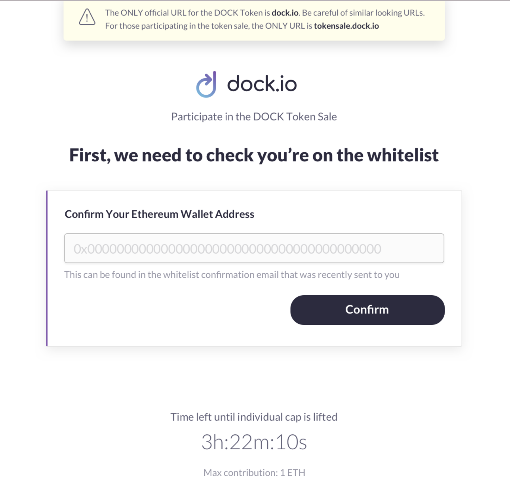
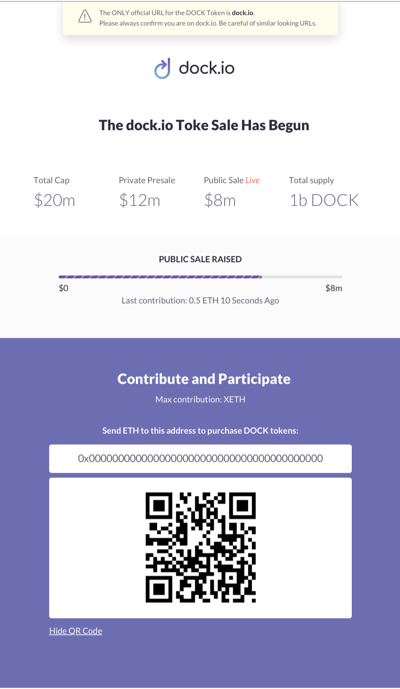
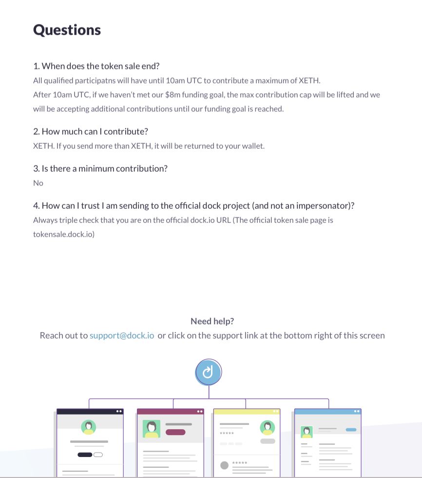

# Token Sale Web App

This repo represents FE code we used for our tokensale web app that we deployed while ICO was active. It contains two main sections which are checking if you can participate and if you can getting access to ETH address where to send funds to and obtain tokens.

## Confirm Page

This page was used as a entry point to tokensale page. We asked the user to enter the ETH address which they submitted to whitelist in order to make sure that they could participate in tokensale.

## Token Sale Page

This page was used to primarily show the ETH address where the user needed to send funds to in order to obtain tokens. We also displayed other helpful information on this page like details on token sale itself and how long it would last.

## Question and Support

We included a section for answering important question that users might have. We also included an email where they could contact us for further help.

